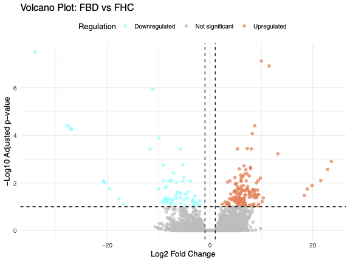
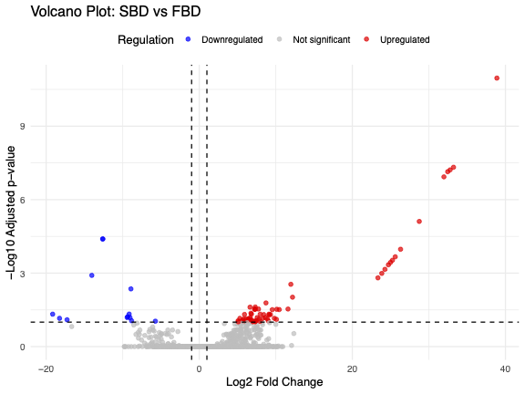
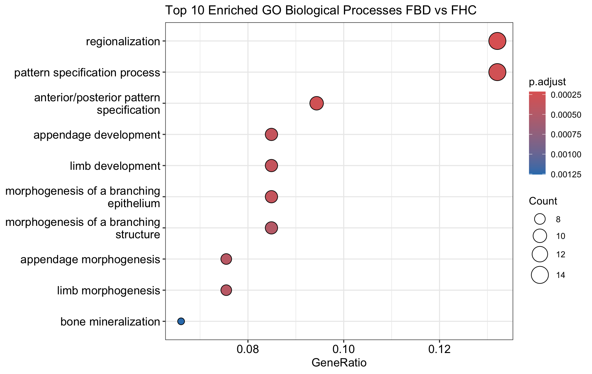

# Bipolar Disorder Type II (BD-II) RNA-seq Analysis Project

## Brief Background

Bipolar Disorder Type II (BD-II) is a chronic psychiatric condition characterized by episodes of depression and hypomania. It significantly impacts mood regulation, cognition, and overall functioning. Despite advances in psychiatric genomics, the molecular underpinnings distinguishing familial BD-II (FBD) from sporadic BD-II (SBD) remain unclear. Understanding these differences can improve diagnosis, prognosis, and treatment strategies.

## Objectives

- Identify **differentially expressed genes (DEGs)** in:
  - SBD vs matched healthy controls (SHC)
  - FBD vs matched healthy controls (FHC)
  - SBD vs FBD
- Compare **molecular pathways** and **functional enrichment** in each group
- Assess **shared vs unique gene signatures**
- Investigate **synaptic**, **immune**, and **developmental** pathways
- Explore **biomarker candidates** and **therapeutic targets**

##  Methods Overview

| Step | Module | Description |
|------|--------|-------------|
| 1    | Data Acquisition | Download raw FASTQ files from SRA |
| 2    | Quality Control | Trim adapters and low-quality reads |
| 3    | Expression Quantification | STAR for indexing and alignment & featureCounts for quantification |
| 4    | Differential Expression | DESeq2 to identify DEGs between groups |
| 5    | Functional Analysis | GO/KEGG enrichment, UpSet plots, PCA |
| 6    | Integration | Compare SBD vs FBD vs Shared DEGs |
| 7    | Interpretation | Annotate biomarkers and pathways of interest |

## Requirements

- R / RStudio (with Bioconductor)
- R packages: `DESeq2`, `org.Hs.eg.db`, `clusterProfiler`, `ggplot2`, `pheatmap`
- STAR (for genome indexing and read alignment)
- featureCounts (for gene-level quantification)
- wget (for downloading raw sequencing data)


## 🔍 Module 1: Data Download, QC and Trimming

- **Tools**: `fastqc`, `fastp`
- Downloaded 8 RNA-Seq samples: 2 each from SBD, FBD, SHC, and FHC.
- Performed adapter removal and read quality trimming.
---
```
  #!/bin/bash

# ============================
# CONFIGURATION
# ============================

# Define base and output directories
BASE_DIR="/home/maa/himabindu/Hackbio-Aug25/Stage2/bipolar_rnaseq"
OUTPUT_DIR="$BASE_DIR/data/raw"

# Create output directory if it doesn't exist
mkdir -p "$OUTPUT_DIR"

# ============================
# DOWNLOAD FASTQ FILES
# ============================

# Each wget downloads a paired-end FASTQ file into the output directory
wget -nc -P "$OUTPUT_DIR" ftp://ftp.sra.ebi.ac.uk/vol1/fastq/SRR332/065/SRR33243165/SRR33243165_1.fastq.gz
wget -nc -P "$OUTPUT_DIR" ftp://ftp.sra.ebi.ac.uk/vol1/fastq/SRR332/065/SRR33243165/SRR33243165_2.fastq.gz

wget -nc -P "$OUTPUT_DIR" ftp://ftp.sra.ebi.ac.uk/vol1/fastq/SRR332/066/SRR33243166/SRR33243166_1.fastq.gz
wget -nc -P "$OUTPUT_DIR" ftp://ftp.sra.ebi.ac.uk/vol1/fastq/SRR332/066/SRR33243166/SRR33243166_2.fastq.gz

wget -nc -P "$OUTPUT_DIR" ftp://ftp.sra.ebi.ac.uk/vol1/fastq/SRR332/064/SRR33243164/SRR33243164_1.fastq.gz
wget -nc -P "$OUTPUT_DIR" ftp://ftp.sra.ebi.ac.uk/vol1/fastq/SRR332/064/SRR33243164/SRR33243164_2.fastq.gz

wget -nc -P "$OUTPUT_DIR" ftp://ftp.sra.ebi.ac.uk/vol1/fastq/SRR332/068/SRR33243168/SRR33243168_1.fastq.gz
wget -nc -P "$OUTPUT_DIR" ftp://ftp.sra.ebi.ac.uk/vol1/fastq/SRR332/068/SRR33243168/SRR33243168_2.fastq.gz

wget -nc -P "$OUTPUT_DIR" ftp://ftp.sra.ebi.ac.uk/vol1/fastq/SRR332/067/SRR33243167/SRR33243167_1.fastq.gz
wget -nc -P "$OUTPUT_DIR" ftp://ftp.sra.ebi.ac.uk/vol1/fastq/SRR332/067/SRR33243167/SRR33243167_2.fastq.gz

wget -nc -P "$OUTPUT_DIR" ftp://ftp.sra.ebi.ac.uk/vol1/fastq/SRR332/070/SRR33243170/SRR33243170_1.fastq.gz
wget -nc -P "$OUTPUT_DIR" ftp://ftp.sra.ebi.ac.uk/vol1/fastq/SRR332/070/SRR33243170/SRR33243170_2.fastq.gz

wget -nc -P "$OUTPUT_DIR" ftp://ftp.sra.ebi.ac.uk/vol1/fastq/SRR332/071/SRR33243171/SRR33243171_1.fastq.gz
wget -nc -P "$OUTPUT_DIR" ftp://ftp.sra.ebi.ac.uk/vol1/fastq/SRR332/071/SRR33243171/SRR33243171_2.fastq.gz

wget -nc -P "$OUTPUT_DIR" ftp://ftp.sra.ebi.ac.uk/vol1/fastq/SRR332/069/SRR33243169/SRR33243169_1.fastq.gz
wget -nc -P "$OUTPUT_DIR" ftp://ftp.sra.ebi.ac.uk/vol1/fastq/SRR332/069/SRR33243169/SRR33243169_2.fastq.gz

# ============================
# DONE
# ============================

echo "Download complete. Files saved to: $OUTPUT_DIR"
```
---
```
#!/bin/bash

# ============================================================
# Script: run_fastqc.sh
# Purpose: Run FastQC on raw FASTQ files
# ============================================================

# 1. CONFIGURATION
BASE_DIR="/home/maa/himabindu/Hackbio-Aug25/Stage2/bipolar_rnaseq"
INPUT_DIR="$BASE_DIR/data/raw"
OUTPUT_DIR_FASTQC="$BASE_DIR/reports/qc_rawdata"

# 2. CHECK & CREATE OUTPUT DIRECTORY
echo "Creating FastQC output directory (if not present)..."
mkdir -p "$OUTPUT_DIR_FASTQC"

# 3. RUN FASTQC
echo "Running FastQC on raw FASTQ files in: $INPUT_DIR"

if [[ ! -d "$INPUT_DIR" ]]; then
    echo "ERROR: Input directory '$INPUT_DIR' does not exist."
    exit 1
fi

# Run FastQC on all fastq.gz files
fastqc "$INPUT_DIR"/*.fastq.gz -o "$OUTPUT_DIR_FASTQC"

echo "FastQC completed. Reports saved to: $OUTPUT_DIR_FASTQC"

```
---
```
#!/bin/bash
# ================================
# Script: run_fastp.sh
# Purpose: Run fastp on raw FASTQ files
# ================================

# Set paths to your directories
BASE_DIR="/home/maa/himabindu/Hackbio-Aug25/Stage2/bipolar_rnaseq"
INPUT_DIR="$BASE_DIR/data/raw"
OUTPUT_DIR="$BASE_DIR/data/trimmed"
REPORT_DIR="$BASE_DIR/reports/fastp"

# Create output directories if they don't exist
mkdir -p "$OUTPUT_DIR"
mkdir -p "$REPORT_DIR"

# Number of threads to use
THREADS=4

echo "Starting fastp quality trimming for paired-end FASTQ files..."

# Loop through all forward reads in INPUT_DIR
for R1 in "$INPUT_DIR"/*_1.fastq.gz; do
    # Derive the reverse read filename by replacing _1.fastq.gz with _2.fastq.gz
    R2="${R1/_1.fastq.gz/_2.fastq.gz}"

    # Extract sample name from filename
    SAMPLE=$(basename "$R1" _1.fastq.gz)

    echo "Processing sample: $SAMPLE"

    # Run fastp with recommended parameters
    fastp \
        -i "$R1" \
        -I "$R2" \
        -o "$OUTPUT_DIR/${SAMPLE}_1.trimmed.fastq.gz" \
        -O "$OUTPUT_DIR/${SAMPLE}_2.trimmed.fastq.gz" \
        --detect_adapter_for_pe \
        --thread "$THREADS" \
        -h "$REPORT_DIR/${SAMPLE}_fastp.html" \
        -j "$REPORT_DIR/${SAMPLE}_fastp.json"

    echo "Finished trimming: $SAMPLE"
done

echo "All samples processed. Trimmed files in: $OUTPUT_DIR"
echo "Fastp reports saved to: $REPORT_DIR"

```
---
### Quality Control Summary

- **FastQC** revealed:
  - High sequence quality across all samples.
  - Presence of duplicated and overrepresented sequences in a few samples, particularly **SRR33243171_1**, which showed the highest duplication rate (**38.9%**).

- **Fastp** filtering results:
  - All samples retained **>42 million** reads after filtering, indicating good sequencing depth.
  - **GC content** ranged from **46.9% to 50.9%**, consistent with expected human transcriptome profiles.
  - **Adapter contamination was low**, with **<1.5% adapter content** in all samples.
  - Over **99% of reads passed filtering (PF)** in every sample, demonstrating high sequencing quality.

## ✅ Module 2: Alignment to Reference Genome

Following quality control, clean reads were aligned to the human reference genome to facilitate accurate transcript quantification.

### Objectives

- Download the **GRCh38 reference genome** and corresponding annotation (GTF).
- Build the **STAR index**.
- Prepare data for alignment in the next module.


### Script: Reference Genome Download & STAR Indexing

The following Bash script performs the full setup for STAR alignment:

---

```
#!/bin/bash

# Variables
BASE_DIR="/home/maa/himabindu/Hackbio-Aug25/Stage2/bipolar_rnaseq"
REF_DIR="$BASE_DIR/reference"
STAR_INDEX_DIR="$REF_DIR/STAR_index"
THREADS=8

# Create directories
mkdir -p "$REF_DIR"
mkdir -p "$STAR_INDEX_DIR"

# Move to reference directory
cd "$REF_DIR"

# Download genome fasta and gtf annotation
echo "Downloading reference genome and annotation..."
wget -c ftp://ftp.ncbi.nlm.nih.gov/genomes/all/GCF/000/001/405/GCF_000001405.40_GRCh38.p14/GCF_000001405.40_GRCh38.p14_genomic.fna.gz
wget -c ftp://ftp.ncbi.nlm.nih.gov/genomes/all/GCF/000/001/405/GCF_000001405.40_GRCh38.p14/GCF_000001405.40_GRCh38.p14_genomic.gtf.gz

# Unzip files
echo "Unzipping reference files..."
gunzip -f GCF_000001405.40_GRCh38.p14_genomic.fna.gz
gunzip -f GCF_000001405.40_GRCh38.p14_genomic.gtf.gz

# File paths
GENOME_FA="$REF_DIR/GCF_000001405.40_GRCh38.p14_genomic.fna"
GTF_FILE="$REF_DIR/GCF_000001405.40_GRCh38.p14_genomic.gtf"

# Build STAR index
echo "Building STAR index..."
STAR --runThreadN $THREADS \
     --runMode genomeGenerate \
     --genomeDir "$STAR_INDEX_DIR" \
     --genomeFastaFiles "$GENOME_FA" \
     --sjdbGTFfile "$GTF_FILE" \
     --sjdbOverhang 99

echo "STAR indexing completed!"
```

---

### Output

- Downloaded reference genome: `GCF_000001405.40_GRCh38.p14_genomic.fna`
- Annotation file: `GCF_000001405.40_GRCh38.p14_genomic.gtf`
- STAR genome index created in: `reference/STAR_index/`

---

> Next: Proceed to read alignment using STAR and quantify gene expression using **featureCounts**.
## Module 3: Read Alignment to Reference Genome

After preparing the STAR index, the next step involves aligning the **trimmed paired-end RNA-seq reads** to the human reference genome. STAR (Spliced Transcripts Alignment to a Reference) was used for its speed and splice-aware alignment capabilities.

---

###  Objectives

- Align each sample to the GRCh38 reference genome using **STAR**.
- Generate **sorted BAM files** and alignments annotated with all SAM attributes.
- Verify successful alignment of all reads.

---

### Script: STAR Alignment of Trimmed Reads

The following Bash script automates the alignment of all paired-end FASTQ files from the trimmed dataset:

```bash
#!/bin/bash

# STAR Alignment Script for paired-end RNA-seq reads
# Aligns trimmed fastq.gz files to a pre-built STAR genome index
# Outputs sorted BAM and gene counts

# Variables
BASE_DIR="/home/maa/himabindu/Hackbio-Aug25/Stage2/bipolar_rnaseq"
FASTQ_DIR="$BASE_DIR/data/trimmed"        # Location of trimmed fastq.gz files
STAR_INDEX_DIR="$BASE_DIR/reference/STAR_index"
OUTPUT_DIR="$BASE_DIR/STAR_alignment_output"
THREADS=6

# Create output directory if it doesn't exist
mkdir -p "$OUTPUT_DIR"

# Check if STAR index directory exists
if [ ! -d "$STAR_INDEX_DIR" ]; then
    echo "Error: STAR index directory not found at $STAR_INDEX_DIR"
    echo "Please build the STAR index first."
    exit 1
fi

# Check if fastq files exist
if [ ! "$(ls $FASTQ_DIR/*_1.trimmed.fastq.gz 2>/dev/null)" ]; then
    echo "Error: No R1 trimmed fastq.gz files found in $FASTQ_DIR"
    exit 1
fi

# Loop through all R1 reads
for r1 in "$FASTQ_DIR"/*_1.trimmed.fastq.gz; do
    sample=$(basename "$r1" | sed 's/_1\.trimmed\.fastq\.gz//')
    r2="$FASTQ_DIR/${sample}_2.trimmed.fastq.gz"

    # Check if paired R2 exists
    if [ ! -f "$r2" ]; then
        echo "Warning: Paired file for $sample not found, skipping sample."
        continue
    fi

    echo "Starting alignment for sample: $sample"

    # Define output prefix and output directory per sample
    SAMPLE_OUT_PREFIX="$OUTPUT_DIR/${sample}_"
    
    # Run STAR alignment
    STAR --runThreadN $THREADS \
         --genomeDir "$STAR_INDEX_DIR" \
         --readFilesIn "$r1" "$r2" \
         --readFilesCommand zcat \
         --outFileNamePrefix "$SAMPLE_OUT_PREFIX" \
         --outSAMtype BAM SortedByCoordinate \
         --outSAMattributes All

    if [ $? -eq 0 ]; then
        echo "Alignment completed successfully for $sample"
    else
        echo "Error during alignment of $sample"
    fi

done

echo "All samples processed."
```

---

### Output Files per Sample

For each sample, STAR produces:

- Sorted BAM file
- Alignment summary
- Splice junctions

---

> Next: Proceed to **quantify gene expression** using `featureCounts` to generate count matrices.
## Module 4: Gene Expression Quantification

Following successful alignment with STAR, this module focuses on **quantifying gene-level expression** using `featureCounts`, a high-performance read summarization tool.

---

### Objectives

- Generate a **gene-level count matrix** from aligned BAM files.
- Use the **GTF annotation** for accurate gene models (from GRCh38.p14).
- Prepare expression data for downstream differential expression analysis.

---

### Script: featureCounts (Quantification)

```bash
#!/bin/bash

# Exit immediately on error
set -e

# Paths
BASE_DIR="/home/maa/himabindu/Hackbio-Aug25/Stage2/bipolar_rnaseq"
ANNOTATION="$BASE_DIR/reference/GCF_000001405.40_GRCh38.p14_genomic.gtf"
OUTPUT_DIR="$BASE_DIR/counts"
BAM_DIR="$BASE_DIR/STAR_alignment_output"

# Create output directory if it doesn't exist
mkdir -p "$OUTPUT_DIR"

# Debug info
echo "Using annotation file: $ANNOTATION"
echo "Looking for BAM files in: $BAM_DIR"
ls "$BAM_DIR"/*_Aligned.sortedByCoord.out.bam || { echo "No BAM files found!"; exit 1; }

# Run featureCounts
CMD="featureCounts -T 4 -p -O -t gene -g gene_id -a \"$ANNOTATION\" -o \"$OUTPUT_DIR\"/counts.txt \"$BAM_DIR\"/*.bam"

echo "Running command:"
echo $CMD

eval $CMD  

echo "featureCounts completed successfully."
```

---

###  Output

- `counts.txt`: A matrix of **raw read counts per gene**, per sample.
- `counts.txt.summary`: Summary of reads assigned and unassigned.
- Counts are grouped using the `gene_id` field from the GTF annotation.
- These counts will be **used in DESeq2** for normalization and statistical testing.

---

> Proceed to **Module 5: Differential Expression Analysis**.

## Module 5: DESeq2 Differential Expression Analysis & Visualization Pipeline

This document provides a full RNA-seq analysis workflow using **DESeq2**, including differential gene expression, PCA, volcano plots, and heatmaps.

---

### 1. Load Required Libraries

```r
library(tidyverse)
library(DESeq2)
library(ggplot2)
library(pheatmap)
library(factoextra)
library(ggrepel)
```

---

###  2. Load and Prepare Count Data

```r
# Load count matrix
raw_counts <- read.delim("counts/counts.txt", header = TRUE)

# Set gene IDs as row names
rownames(raw_counts) <- raw_counts$Geneid

# Select only count columns
count_data <- raw_counts[, 7:ncol(raw_counts)]

# Ensure numeric format
count_data <- as.data.frame(lapply(count_data, as.numeric))
rownames(count_data) <- raw_counts$Geneid

# Preview
head(count_data)
```

---

### 3. Define Sample Metadata

```r
# Create metadata dataframe for all samples
metadata <- data.frame(
  SampleID = c("SRR33243164", "SRR33243165", "SRR33243166", "SRR33243167",
               "SRR33243168", "SRR33243169", "SRR33243170", "SRR33243171"),
  Condition = c("SBD", "SBD", "FBD", "FBD", "SHC", "SHC", "FHC", "FHC")  # Assign condition labels
)

# Reorder metadata rows to match the column order of the count data
metadata <- metadata[match(colnames(count_data), metadata$SampleID), ]

# Check that metadata and count data columns are now aligned (should return TRUE)
stopifnot(all(metadata$SampleID == colnames(count_data)))

# Define colData to be used in DESeq2 object
colData <- data.frame(
  sample = colnames(count_data),  # Sample names from count matrix
  condition = factor(metadata$Condition, levels = c("SHC", "SBD", "FBD", "FHC"))  # Set condition factor with desired order
)

```

---

### 4. Differential Expression Analysis (DESeq2)

```r
# Create a DESeq2 dataset object
# 'dds' stands for "DESeqDataSet" — a special object that stores count data, sample info, and the experimental design
dds <- DESeqDataSetFromMatrix(
  countData = count_data,  # matrix of raw counts (genes x samples)
  colData = colData,       # metadata: sample names and conditions
  design = ~ condition     # model design formula: test differences based on 'condition'
)

# Run the DESeq2 differential expression analysis
dds <- DESeq(dds)
```
```
# Extract results (DEGs) for each comparison of interest
# This compares SBD vs SHC (e.g. sporadic bipolar vs healthy control)
res_sbd_shc <- results(dds, contrast = c("condition", "SBD", "SHC"))

# This compares FBD vs FHC (familial bipolar vs familial healthy control)
res_fbd_fhc <- results(dds, contrast = c("condition", "FBD", "FHC"))

# This compares SBD vs FBD (sporadic vs familial bipolar)
res_sbd_fbd <- results(dds, contrast = c("condition", "SBD", "FBD"))


```
```
# View the top differentially expressed genes (by adjusted p-value) for each comparison
head(res_sbd_shc[order(res_sbd_shc$padj), ])  # Top genes: SBD vs SHC
head(res_fbd_fhc[order(res_fbd_fhc$padj), ])  # Top genes: FBD vs FHC
head(res_sbd_fbd[order(res_sbd_fbd$padj), ])  # Top genes: SBD vs FBD
```

---


- `dds` stands for **DESeqDataSet**, the core object used by the DESeq2 package.

It contains:

- The raw count matrix.
- The sample metadata.
- The experimental design (i.e., how you want to compare groups).

After running `DESeq(dds)`, it includes:

- Size factor normalization
- Dispersion estimation
- Model fitting and statistical testing.


### 5. PCA Analysis

```r
# Perform variance stabilizing transformation (VST) on the DESeqDataSet
vsd <- vst(dds, blind = FALSE)

# Perform Principal Component Analysis (PCA) on the transformed data
# 'assay(vsd)' extracts the normalized expression matrix
# 't()' transposes the matrix to have samples as rows
pca_res <- prcomp(t(assay(vsd)))

# Show the amount of variance explained by each principal component
summary(pca_res)

# Extract the condition information from sample metadata
condition <- colData(dds)$condition

# Test if PC1 scores differ significantly between conditions using ANOVA
summary(aov(pca_res$x[,1] ~ condition))

# Test if PC2 scores differ significantly between conditions using ANOVA
summary(aov(pca_res$x[,2] ~ condition))

# Generate PCA plot data, grouping samples by 'condition'
pcaData <- plotPCA(vsd, intgroup = "condition", returnData = TRUE)

# Calculate percentage variance explained for PC1 and PC2
percentVar <- round(100 * attr(pcaData, "percentVar"))

# Plot PCA with ggplot2, coloring points by condition
ggplot(pcaData, aes(PC1, PC2, color = condition)) +
  geom_point(size = 4) +
  xlab(paste0("PC1: ", percentVar[1], "% variance")) +
  ylab(paste0("PC2: ", percentVar[2], "% variance")) +
  ggtitle("PCA of Samples") +
  theme_minimal()
```


---

###  6. PCA Colored by Age

```r
# Define the age vector corresponding to each sample
age <- c(33, 28, 36, 38, 24, 25, 45, 67)

# Create a metadata dataframe combining condition and age for each sample
metadata <- data.frame(
  Condition = colData(dds)$condition,
  Age = age
)

# Visualize PCA results with individuals colored by age
# This helps explore if age correlates with variation in the data
fviz_pca_ind(pca_res,
             geom.ind = "point",    # plot points for individuals
             col.ind = age,         # color points by age
             addEllipses = FALSE,   # no group ellipses since age is continuous
             legend.title = "Age",
             repel = TRUE)          # avoid overlapping labels

# Test correlation between age and PC1 scores to see if age explains variation along PC1
cor.test(age, pca_res$x[, 1])

# Test correlation between age and PC2 scores to see if age explains variation along PC2
cor.test(age, pca_res$x[, 2])
```

---
### PCA Plot

This PCA plot visualizes how samples cluster by their gene expression profiles, helping to identify patterns or batch effects related to experimental conditions.


---
####  PCA Summary

- **Principal Component Analysis (PCA)** was conducted on variance-stabilized data to explore global gene expression patterns across sample groups (SBD, FBD, SHC, FHC).
- The **first two principal components** explained ~63% of the total variance:
  - **PC1:** 43.5%
  - **PC2:** 20%

####  Observations:

- SHC samples (ages 24 & 25) clustered closely, showing consistent expression profiles.
- FHC samples (ages 45 & 67) were more dispersed, suggesting greater variability.
- SBD and FBD samples showed partial grouping, possibly influenced by age differences.
- One-way **ANOVA on PC1 and PC2** showed no significant group differences:
  - PC1: *p = 0.956*
  - PC2: *p = 0.371*

####  Age as a Covariate:

- **Correlation with PC2:**  
  - Significant positive correlation with age (r = 0.72, *p = 0.043*)
- **Correlation with PC1:**  
  - Not significant (r = -0.51, *p = 0.19*)

**Conclusion:**  
PC2 likely captures **age-related gene expression variation**, suggesting **age may be a confounding factor**. Further modeling including age as a covariate is recommended.

---
###  7. Compare DEs - Volcano Plots

```
# Function to process DESeq2 results into a tidy dataframe
process_deseq_results <- function(res_df, padj_cutoff = 0.1, log2fc_cutoff = 1) {
  df <- as.data.frame(res_df)             # Convert DESeq2 result object to data frame
  df$gene <- rownames(df)                 # Add gene names as a new column
  
  df <- df %>%
    filter(!is.na(padj)) %>%              # Remove rows where adjusted p-value is NA
    mutate(
      # Label each gene based on significance thresholds
      sig = case_when(
        padj < padj_cutoff & log2FoldChange > log2fc_cutoff ~ "Upregulated",
        padj < padj_cutoff & log2FoldChange < -log2fc_cutoff ~ "Downregulated",
        TRUE ~ "Not significant"
      )
    )
  
  return(df)
}

# Function to extract top N significant genes by smallest adjusted p-value
get_top_genes <- function(df, top_n = 20) {
  ordered_indices <- order(df$padj)       # Order by padj ascending
  top_genes <- df[ordered_indices[1:top_n], ]  # Select top N genes
  return(top_genes)
}

# Function to create a volcano plot from processed DESeq2 results
plot_volcano <- function(df, title, 
                         colors = c("Upregulated" = "red", 
                                    "Downregulated" = "blue", 
                                    "Not significant" = "gray")) {
  
  ggplot(df, aes(x = log2FoldChange, y = -log10(padj), color = sig)) +
    geom_point(alpha = 0.7, size = 1.8) +                      # Scatter plot points with transparency
    geom_vline(xintercept = c(-1, 1), linetype = "dashed", color = "black") +  # Threshold lines for FC
    geom_hline(yintercept = -log10(0.1), linetype = "dashed", color = "black") + # Significance cutoff line
    scale_color_manual(values = colors) +                       # Custom colors for significance categories
    theme_minimal(base_size = 13) +                             # Clean minimal theme with larger font
    labs(
      title = title,
      x = "Log2 Fold Change",
      y = "-Log10 Adjusted p-value",
      color = "Regulation"
    ) +
    theme(legend.position = "top")                              # Place legend on top
}

```
---
### SBD vs SHC
```
# Process DESeq2 results
res_df_s <- process_deseq_results(res_sbd_shc)

# Extract and print top 20 significant genes
top_genes_s <- get_top_genes(res_df_s)
print(top_genes_s)

# Plot volcano plot
plot_volcano(res_df_s, "Volcano Plot: SBD vs SHC")
```

---


### Volcano Plot Interpretation: SBD vs SHC

The volcano plot displays the results of differential expression analysis comparing SBD to SHC:

- Each point represents a gene, plotted by its log2 fold change (x-axis) and the statistical significance as -log10 adjusted p-value (y-axis).
- Genes colored **red** are significantly **upregulated** in SBD compared to SHC, with large positive fold changes and adjusted p-values below 0.1.
- Genes colored **blue** are significantly **downregulated** in SBD compared to SHC, with large negative fold changes and adjusted p-values below 0.1.
- Gray points represent genes without significant differential expression.
- The dashed vertical lines at ±1 on the x-axis denote the fold change threshold, while the dashed horizontal line marks the adjusted p-value cutoff.
- This plot helps identify genes with both biologically meaningful changes (fold change) and statistical significance, highlighting candidates potentially involved in disease pathology.
---

### FBD vs FHC
```
# Process DESeq2 results
res_df_f <- process_deseq_results(res_fbd_fhc)

# Extract and print top 20 significant genes
top_genes_f <- get_top_genes(res_df_f)
print(top_genes_f)

# Plot volcano plot with custom colors
plot_volcano(res_df_f, "Volcano Plot: FBD vs FHC",
             colors = c("Upregulated" = "coral", 
                        "Downregulated" = "cyan", 
                        "Not significant" = "gray"))

```
---


---
### SBD vs FBD
```
# Process DESeq2 results
res_df_f <- process_deseq_results(res_fbd_fhc)

# Extract and print top 20 significant genes
top_genes_f <- get_top_genes(res_df_f)
print(top_genes_f)

# Plot volcano plot with custom colors
plot_volcano(res_df_f, "Volcano Plot: FBD vs FHC",
             colors = c("Upregulated" = "coral", 
                        "Downregulated" = "cyan", 
                        "Not significant" = "gray"))
```
---



---

### Comparing top Differentially Expressed Genes (DEGs) across conditions

In this section, we compare the top 20 DEGs from each contrast:
- **SBD vs SHC** (sporadic vs control)
- **FBD vs FHC** (familial vs control)
- **SBD vs FBD** (sporadic vs familial)

This comparison helps identify shared and unique genes, as well as their regulation patterns across conditions.


```r
########################################
# Compare Top 20 Differentially Expressed Genes
########################################

# data frames :
# - top_genes_s: Top DEGs in SBD vs SHC
# - top_genes_f: Top DEGs in FBD vs FHC
# - top_genes_bd: Top DEGs in SBD vs FBD


# Extract gene names and their significance status
df1 <- top_genes_s[, c("gene", "sig")]
df2 <- top_genes_f[, c("gene", "sig")]
df3 <- top_genes_bd[, c("gene", "sig")]

# Rename 'sig' column to indicate each comparison
colnames(df1)[2] <- "SBD_vs_SHC"
colnames(df2)[2] <- "FBD_vs_FHC"
colnames(df3)[2] <- "SBD_vs_FBD"


# Merge all three data frames by gene
comparison_df <- full_join(df1, df2, by = "gene") %>%
  full_join(., df3, by = "gene") %>%
  arrange(gene)

# Replace NA (missing values) with "-"
comparison_df[is.na(comparison_df)] <- "-"

# View the comparison table
print(comparison_df)

# Save to CSV 
write.csv(comparison_df, "Top20_DEGs_Comparison.csv", row.names = FALSE)
```
| Gene         | SBD_vs_SHC   | FBD_vs_FHC   | SBD_vs_FBD   |
|--------------|--------------|--------------|--------------|
| C1QB         | Upregulated  | Downregulated| Upregulated  |
| C1QC         | Upregulated  | -            | -            |
| CD180        | -            | -            | Upregulated  |
| CD300LF      | Upregulated  | Downregulated| Upregulated  |
| CD84         | -            | -            | Upregulated  |
| CD84-AS1     | -            | -            | Upregulated  |
| CILP         | -            | Upregulated  | -            |
| COL15A1      | -            | Upregulated  | -            |
| COL15A1-AS1  | -            | Upregulated  | -            |
| CYP4F29P     | -            | -            | Upregulated  |
| CYTH4        | -            | -            | Upregulated  |
| DCN          | -            | Upregulated  | -            |
| DDR1_2       | -            | Downregulated| -            |
| FAM239A      | -            | Upregulated  | -            |
| FCGBP        | Upregulated  | -            | -            |
| FCGR3A       | Upregulated  | -            | -            |
| GIMAP6       | -            | -            | Upregulated  |
| HCG17_4      | -            | Upregulated  | -            |
| HGF          | -            | Upregulated  | -            |
| HLA-A        | Downregulated| -            | Downregulated|
| HSD3B2       | -            | Upregulated  | -            |
| KLRC2        | -            | Downregulated| -            |
| LEP          | Downregulated| -            | -            |
| LINC01235    | Upregulated  | -            | -            |
| LINC02154    | -            | Downregulated| -            |
| LOC105378027 | -            | Downregulated| -            |
| LOC107984671 | Upregulated  | -            | -            |
| LOC107986121 | -            | Downregulated| -            |
| LOC124901298 | Downregulated| -            | Downregulated|
| LOC124901761 | Upregulated  | -            | Upregulated  |
| LY86         | -            | -            | Upregulated  |
| MIR223HG     | Upregulated  | Downregulated| Upregulated  |
| NCKAP1L      | Upregulated  | -            | -            |
| NIPA2        | -            | -            | Downregulated|
| NME8         | -            | Downregulated| -            |
| P2RY13       | Upregulated  | -            | -            |
| PIGR         | Upregulated  | -            | Upregulated  |
| PLEK         | -            | -            | Upregulated  |
| PPP1R11_6    | -            | -            | Upregulated  |
| PSG7         | Downregulated| -            | -            |
| PSPHP1       | -            | Downregulated| -            |
| RETN         | Upregulated  | -            | -            |
| RSPO2        | -            | Upregulated  | -            |
| SPI1         | Upregulated  | -            | -            |
| TLR10        | Upregulated  | Downregulated| Upregulated  |
| VSIG4        | Upregulated  | -            | Upregulated  |
| ZNF208       | -            | -            | Downregulated|

---
#### Interpretation:

Several genes show consistent upregulation in the sporadic condition (SBD vs SHC) and familial condition (SBD vs FBD), but downregulation in familial vs healthy controls (FBD vs FHC). This suggests these genes may be critical in distinguishing sporadic from familial cases and may have contrasting roles in these contexts. This comparative analysis reveals overlapping and unique gene expression changes that help differentiate sporadic and familial forms of the disease. Genes showing consistent regulation across comparisons might represent shared pathological mechanisms, while uniquely regulated genes may pinpoint specific biological pathways or targets relevant to sporadic or familial disease etiology.

Genes such as **C1QB, C1QC, CD300LF, CD84, CD84-AS1, and CD180** are predominantly upregulated in sporadic cases. These genes are involved in immune functions including complement activation, lymphocyte regulation, and immune cell signaling.

Genes like **CILP, COL15A1, COL15A1-AS1, DCN, and DDR1_2** show altered expression in familial cases and are associated with extracellular matrix organization and tissue remodeling.

Metabolic and signaling-related genes, including **CYP4F29P** and **CYTH4**, are specifically upregulated in sporadic disease, suggesting differences in lipid metabolism and intracellular signaling pathways.

To investigate whether these pathways are functionally enriched, we will perform pathway enrichment analysis (GO/KEGG) in the downstream steps.


### 8. Heatmaps of DEGs

#### a. SBD vs SHC

```r
# Following the volcano plot, we focus on the significantly differentially expressed genes (DEGs)
# between SBD and SHC for further exploration of expression patterns across samples.

# Filter DEGs based on adjusted p-value and log2 fold change thresholds
deg_sbd_shc <- res_sbd_shc %>% as.data.frame() %>%
  filter(padj < 0.1 & abs(log2FoldChange) > 1)

# Extract gene names of DEGs
deg_genes <- rownames(deg_sbd_shc)

# Get normalized counts from DESeq2 object and log-transform them for visualization
norm_counts <- counts(dds, normalized = TRUE)
log_norm_counts_deg <- log2(norm_counts[deg_genes, ] + 1)

# Create a sample annotation data frame for coloring columns by condition
sample_annot <- as.data.frame(colData(dds)[, "condition", drop = FALSE])
colnames(sample_annot) <- "Condition"

# Plot heatmap of the log-transformed normalized counts of DEGs,
# scaling by row to highlight relative expression differences across samples,
# and clustering rows and columns by correlation distance
pheatmap(log_norm_counts_deg,
         annotation_col = sample_annot,
         scale = "row",
         clustering_distance_rows = "correlation",
         clustering_distance_cols = "correlation",
         main = "Heatmap: SBD vs SHC DEGs")
```

#### b. FBD vs FHC


_Repeat using `res_fbd_fhc`._

---

###  9. Combined Heatmap (SBD vs SHC & FBD vs FHC)

```r
# Extract DEGs
deg_sbd_shc <- res_sbd_shc %>% as.data.frame() %>% filter(padj < 0.1 & abs(log2FoldChange) > 1)
deg_fbd_fhc <- res_fbd_fhc %>% as.data.frame() %>% filter(padj < 0.1 & abs(log2FoldChange) > 1)

combined_genes <- union(rownames(deg_sbd_shc), rownames(deg_fbd_fhc))

# Log-normalized matrix
norm_counts <- counts(dds, normalized = TRUE)
log_deg_counts <- log2(norm_counts[combined_genes, ] + 1)

# Rename columns
colnames(log_deg_counts) <- c("SBD-1", "SBD-2", "FBD-1", "FBD-2", "SHC-1", "SHC-2", "FHC-1", "FHC-2")
rownames(sample_annot) <- colnames(log_deg_counts)

# Heatmap
pheatmap(log_deg_counts,
         annotation_col = sample_annot,
         scale = "row",
         clustering_distance_rows = "correlation",
         clustering_distance_cols = "correlation",
         main = "Combined Heatmap: SBD vs SHC & FBD vs FHC")
```

---


### Interpretation: Combined DEGs from SBD vs SHC and FBD vs FHC

This heatmap visualizes the expression patterns of differentially expressed genes (DEGs) identified from the comparisons between SBD vs SHC and FBD vs FHC conditions.

- The samples cluster distinctly by condition groups, indicating consistent differential expression patterns within each group.
- Clear separation between SBD and SHC samples, as well as between FBD and FHC samples, suggests strong condition-specific gene expression differences.
- The color gradient from blue to red represents low to high expression levels, respectively, with many genes showing consistent upregulation or downregulation within each condition.
- Some overlap or transitional patterns may be observed between closely related conditions, indicating possible shared molecular mechanisms or biological pathways.
- Overall, this combined heatmap highlights transcriptional differences across bipolar disorder and healthy control groups, supporting the validity of the identified DEGs.

This visualization helps to confirm that the DEGs reflect meaningful biological variation linked to the conditions studied.


### 10. Functional Enrichment

```r
# Continuing from the previous heatmap step where DEGs between SBD and SHC were identified,
# we now perform pathway enrichment analysis to understand the biological processes
# associated with these differentially expressed genes (DEGs).

##########################
# Install and load necessary Bioconductor packages for enrichment analysis
if (!requireNamespace("BiocManager", quietly = TRUE))
  install.packages("BiocManager")

BiocManager::install("clusterProfiler")   # For enrichment analysis
BiocManager::install("org.Hs.eg.db")      # Human gene annotation database

library(clusterProfiler)
library(org.Hs.eg.db)

##########################
# Extract gene symbols from DEG results for each comparison
genes_sbd_shc <- rownames(deg_sbd_shc)
genes_fbd_fhc <- rownames(deg_fbd_fhc)
genes_sbd_fbd <- rownames(deg_sbd_fbd)

##########################
# Map gene symbols to Entrez IDs (required for enrichment analysis)
entrez_sbd_shc <- bitr(genes_sbd_shc, fromType = "SYMBOL",
                       toType = "ENTREZID",
                       OrgDb = org.Hs.eg.db)

entrez_fbd_fhc <- bitr(genes_fbd_fhc, fromType = "SYMBOL",
                       toType = "ENTREZID",
                       OrgDb = org.Hs.eg.db)

entrez_sbd_fbd <- bitr(genes_sbd_fbd, fromType = "SYMBOL",
                       toType = "ENTREZID",
                       OrgDb = org.Hs.eg.db)

##########################
# Optional: Remove duplicated Entrez IDs to avoid redundancy
entrez_sbd_shc <- entrez_sbd_shc[!duplicated(entrez_sbd_shc$ENTREZID), ]
entrez_fbd_fhc <- entrez_fbd_fhc[!duplicated(entrez_fbd_fhc$ENTREZID), ]
entrez_sbd_fbd <- entrez_sbd_fbd[!duplicated(entrez_sbd_fbd$ENTREZID), ]

##########################
# Prepare background gene list for enrichment (all genes tested)
all_genes <- rownames(dds)  # Use all genes from DESeq2 object

background_entrez <- bitr(all_genes, fromType = "SYMBOL", 
                         toType = "ENTREZID", 
                         OrgDb = org.Hs.eg.db)

##########################
# Perform Gene Ontology (GO) Biological Process (BP) enrichment analysis
# for each DEG set against the background gene universe

ego_sbd_shc <- enrichGO(
  gene          = entrez_sbd_shc$ENTREZID,      # DEG Entrez IDs
  universe      = background_entrez$ENTREZID,  # Background Entrez IDs
  OrgDb         = org.Hs.eg.db,
  keyType       = "ENTREZID",
  ont           = "BP",                         # Biological Process ontology
  pAdjustMethod = "BH",                         # Benjamini-Hochberg correction
  pvalueCutoff  = 0.05,                         # Significance threshold
  qvalueCutoff  = 0.1
)

ego_fbd_fhc <- enrichGO(
  gene          = entrez_fbd_fhc$ENTREZID,
  universe      = background_entrez$ENTREZID,
  OrgDb         = org.Hs.eg.db,
  keyType       = "ENTREZID",
  ont           = "BP",
  pAdjustMethod = "BH",
  pvalueCutoff  = 0.05,
  qvalueCutoff  = 0.1
)

ego_sbd_fbd <- enrichGO(
  gene          = entrez_sbd_fbd$ENTREZID,
  universe      = background_entrez$ENTREZID,
  OrgDb         = org.Hs.eg.db,
  keyType       = "ENTREZID",
  ont           = "BP",
  pAdjustMethod = "BH",
  pvalueCutoff  = 0.05,
  qvalueCutoff  = 0.1
)

##########################
# Convert enrichment results to data frames for easier manipulation

df_ego_sbd_shc <- as.data.frame(ego_sbd_shc)
df_ego_fbd_fhc <- as.data.frame(ego_fbd_fhc)
df_ego_sbd_fbd <- as.data.frame(ego_sbd_fbd)

##########################
# Filter GO terms for relevance by keywords related to 
# immune, neurological, synaptic, phagosome, lysosome, signaling, MAPK pathways
keywords <- "immune|neuro|synap|phagosome|lysosome|signal|MAPK"

relevant_ego_sbd_shc <- df_ego_sbd_shc[grep(keywords, df_ego_sbd_shc$Description, ignore.case = TRUE), ]
relevant_ego_fbd_fhc <- df_ego_fbd_fhc[grep(keywords, df_ego_fbd_fhc$Description, ignore.case = TRUE), ]
relevant_ego_sbd_fbd <- df_ego_sbd_fbd[grep(keywords, df_ego_sbd_fbd$Description, ignore.case = TRUE), ]
 ```

### KEGG Pathway Enrichment Analysis

After performing Gene Ontology (GO) enrichment to identify biological processes associated with differentially expressed genes (DEGs), we conduct KEGG pathway enrichment analysis to further explore relevant signaling and metabolic pathways.

KEGG (Kyoto Encyclopedia of Genes and Genomes) provides curated pathway maps, helping to link gene lists to specific molecular interaction networks and cellular processes.

This step helps to:
- Identify pathways significantly enriched among DEGs.
- Gain insights into biological mechanisms potentially impacted in the different conditions (e.g., SBD vs SHC).
- Complement GO analysis by focusing on well-defined biochemical and signaling pathways.


```r
library(clusterProfiler)

# Function to perform KEGG enrichment for a given set of DEGs and background
perform_kegg_enrichment <- function(deg_entrez_df, background_entrez_df, organism = "hsa",
                                   pvalueCutoff = 0.05, qvalueCutoff = 0.1) {
  # deg_entrez_df: data.frame with at least a column named "ENTREZID" containing DEG Entrez IDs
  # background_entrez_df: data.frame with at least a column named "ENTREZID" for background genes
  # organism: KEGG organism code (default "hsa" for human)
  # pvalueCutoff: p-value threshold for significance
  # qvalueCutoff: q-value (FDR) threshold for significance

  enrichment_results <- enrichKEGG(
    gene         = deg_entrez_df$ENTREZID,
    organism     = organism,
    keyType      = "kegg",
    pvalueCutoff = pvalueCutoff,
    qvalueCutoff = qvalueCutoff,
    universe     = background_entrez_df$ENTREZID
  )
  
  # Return the enrichment results object
  return(enrichment_results)
}

# Run KEGG enrichment for your comparisons:
kegg_sbd_shc <- perform_kegg_enrichment(entrez_sbd_shc, background_entrez)
kegg_fbd_fhc <- perform_kegg_enrichment(entrez_fbd_fhc, background_entrez)
kegg_sbd_fbd <- perform_kegg_enrichment(entrez_sbd_fbd, background_entrez)

# Convert to data frames for easier viewing and filtering:
df_kegg_sbd_shc <- as.data.frame(kegg_sbd_shc)
df_kegg_fbd_fhc <- as.data.frame(kegg_fbd_fhc)
df_kegg_sbd_fbd <- as.data.frame(kegg_sbd_fbd)

# Filter relevant pathways by keywords
filter_keywords <- "immune|neuro|synap|phagosome|lysosome|signal|MAPK"

relevant_kegg_sbd_shc <- df_kegg_sbd_shc[grep(filter_keywords, df_kegg_sbd_shc$Description, ignore.case = TRUE), ]
relevant_kegg_fbd_fhc <- df_kegg_fbd_fhc[grep(filter_keywords, df_kegg_fbd_fhc$Description, ignore.case = TRUE), ]
relevant_kegg_sbd_fbd <- df_kegg_sbd_fbd[grep(filter_keywords, df_kegg_sbd_fbd$Description, ignore.case = TRUE), ]

# Print filtered KEGG pathways for SBD vs SHC comparison
print(relevant_kegg_sbd_shc)

```
### Visualize GO and KEGG Enrichment Results

Before interpreting the biological significance of the differentially expressed genes (DEGs), it is important to understand which biological processes and pathways are enriched in each comparison. 

Gene Ontology (GO) enrichment reveals overrepresented biological processes associated with the DEGs, while KEGG pathway analysis identifies relevant signaling and metabolic pathways.

Visualizing these enrichments with dotplots and barplots helps summarize the key functional categories and pathways that may drive the observed differences between conditions, providing biological insights into the dataset.

```r


### Visualize GO Biological Process (BP) enrichment results

# 1. SBD vs SHC comparison
# Dotplot showing top 10 enriched GO BP terms
dotplot(ego_sbd_shc, showCategory = 10) + 
  ggtitle("Top 10 Enriched GO Biological Processes SBD vs SHC")

# Barplot showing top 10 enriched GO BP terms
barplot(ego_sbd_shc, showCategory = 10) + 
  ggtitle("Top 10 Enriched GO Biological Processes SBD vs SHC")

# 2. FBD vs FHC comparison
dotplot(ego_fbd_fhc, showCategory = 10) + 
  ggtitle("Top 10 Enriched GO Biological Processes FBD vs FHC")

barplot(ego_fbd_fhc, showCategory = 10) + 
  ggtitle("Top 10 Enriched GO Biological Processes FBD vs FHC")

# 3. SBD vs FBD comparison
dotplot(ego_sbd_fbd, showCategory = 10) + 
  ggtitle("Top 10 Enriched GO Biological Processes SBD vs FBD")

barplot(ego_sbd_fbd, showCategory = 10) + 
  ggtitle("Top 10 Enriched GO Biological Processes SBD vs FBD")


### Visualize KEGG pathway enrichment results

# 1. SBD vs SHC comparison
dotplot(ekegg_sbd_shc, showCategory = 10) + 
  ggtitle("Top 10 Enriched KEGG Pathways SBD vs SHC")

barplot(ekegg_sbd_shc, showCategory = 10) + 
  ggtitle("Top 10 Enriched KEGG Pathways SBD vs SHC")

# 2. FBD vs FHC comparison
dotplot(ekegg_fbd_fhc, showCategory = 10) + 
  ggtitle("Top 10 Enriched KEGG Pathways FBD vs FHC")

barplot(ekegg_fbd_fhc, showCategory = 10) + 
  ggtitle("Top 10 Enriched KEGG Pathways FBD vs FHC")

# 3. SBD vs FBD comparison
dotplot(ekegg_sbd_fbd, showCategory = 10) + 
  ggtitle("Top 10 Enriched KEGG Pathways SBD vs FBD")

barplot(ekegg_sbd_fbd, showCategory = 10) + 
  ggtitle("Top 10 Enriched KEGG Pathways SBD vs FBD")


```





#### Interpretation :

The dot plot for SBD vs SHC comparison reveals that biological processes such as **leukocyte mediated immunity**, **cytotoxicity**, and **leukocyte cell-cell adhesion** are highly enriched. 

This suggests that immune-related functions are significantly involved in the differences between these two conditions, highlighting the potential role of immune system activity and cell interactions in the underlying biological mechanisms.

In the **SBD vs FBD** dot plot, processes related to **leukocyte mediated immunity**, **cytotoxicity**, and **leukocyte cell-cell adhesion** are highly enriched. This indicates a strong involvement of immune system activities and cell interaction pathways differentiating these two conditions.

In the **FBD vs FHC** dot plot, enrichment is observed predominantly in **morphogenesis-related** biological processes, suggesting developmental and structural changes may be key factors distinguishing these groups.


### Compare shared and unique DEGs: SBD vs FBD

# This section identifies overlapping and unique differentially expressed genes (DEGs)
# between SBD vs SHC and FBD vs FHC contrasts.
# Then it performs GO enrichment on each set to identify biological processes
# and highlights immune- and neuronal-related functions.

```
# Define gene lists

# genes_sbd_shc <- character vector of DEG symbols from SBD vs SHC
# genes_fbd_fhc <- character vector of DEG symbols from FBD vs FHC

#  1. Identify shared and unique DEGs
shared_genes <- intersect(genes_sbd_shc, genes_fbd_fhc)
unique_sbd_shc <- setdiff(genes_sbd_shc, genes_fbd_fhc)
unique_fbd_fhc <- setdiff(genes_fbd_fhc, genes_sbd_shc)

# 2. Print DEG counts
cat("Number of DEGs in SBD vs SHC:", length(genes_sbd_shc), "\n")
cat("Number of DEGs in FBD vs FHC:", length(genes_fbd_fhc), "\n")
cat("Number of shared DEGs:", length(shared_genes), "\n")
cat("Number of unique DEGs in SBD vs SHC:", length(unique_sbd_shc), "\n")
cat("Number of unique DEGs in FBD vs FHC:", length(unique_fbd_fhc), "\n")


# Convert Gene Symbols to Entrez IDs (for GO)

shared_entrez <- bitr(shared_genes, fromType="SYMBOL", toType="ENTREZID", OrgDb="org.Hs.eg.db")$ENTREZID
unique_sbd_shc_entrez <- bitr(unique_sbd_shc, fromType="SYMBOL", toType="ENTREZID", OrgDb="org.Hs.eg.db")$ENTREZID
unique_fbd_fhc_entrez <- bitr(unique_fbd_fhc, fromType="SYMBOL", toType="ENTREZID", OrgDb="org.Hs.eg.db")$ENTREZID


# GO Enrichment: Biological Process (BP)
# pvalueCutoff and qvalueCutoff can be adjusted if needed

ego_shared <- enrichGO(
  gene = shared_entrez,
  OrgDb = org.Hs.eg.db,
  keyType = "ENTREZID",
  ont = "BP",
  pAdjustMethod = "BH",
  pvalueCutoff = 0.05,
  qvalueCutoff = 0.2
)

ego_sbd_unique <- enrichGO(
  gene = unique_sbd_shc_entrez,
  OrgDb = org.Hs.eg.db,
  keyType = "ENTREZID",
  ont = "BP",
  pAdjustMethod = "BH",
  pvalueCutoff = 0.05,
  qvalueCutoff = 0.2
)

ego_fbd_unique <- enrichGO(
  gene = unique_fbd_fhc_entrez,
  OrgDb = org.Hs.eg.db,
  keyType = "ENTREZID",
  ont = "BP",
  pAdjustMethod = "BH",
  pvalueCutoff = 0.05,
  qvalueCutoff = 0.2
)


# Filter GO terms for immune and neuro-related processes
# Define keyword patterns for immune and neuronal processes
immune_keywords <- "immune|cytokine|leukocyte|inflammatory|cytotoxic"
neuro_keywords <- "synap|neuro|axon|dendrite|neuron|transmission|development"

# Immune-related terms
immune_terms_sbd <- ego_sbd_unique[grep(immune_keywords, ego_sbd_unique$Description, ignore.case = TRUE), ]
immune_terms_fbd <- ego_fbd_unique[grep(immune_keywords, ego_fbd_unique$Description, ignore.case = TRUE), ]
immune_terms_shared <- ego_shared[grep(immune_keywords, ego_shared$Description, ignore.case = TRUE), ]

# Neuronal-related terms
synaptic_terms_sbd <- ego_sbd_unique[grep(neuro_keywords, ego_sbd_unique$Description, ignore.case = TRUE), ]
synaptic_terms_fbd <- ego_fbd_unique[grep(neuro_keywords, ego_fbd_unique$Description, ignore.case = TRUE), ]
synaptic_terms_shared <- ego_shared[grep(neuro_keywords, ego_shared$Description, ignore.case = TRUE), ]

```
---
### Transcriptional Program Analysis in BD-II: Shared and Distinct Pathways


As part of our **integrative transcriptomic analysis**, we aimed to dissect the **shared** and **distinct** transcriptional programs between **sporadic BD (SBD)** and **familial BD (FBD)**. By comparing DEGs (Differentially Expressed Genes) between:

- **SBD vs SHC** (sporadic cases vs healthy controls),
- **FBD vs FHC** (familial cases vs healthy controls),
- **SBD vs FBD** (direct case-case comparison),

we identified **shared** and **unique DEGs** and subjected each group to **GO Biological Process enrichment**.

#### What does this tell us?

This analysis helps:
- Reveal **common molecular mechanisms** underlying BD-II across sporadic and familial forms.
- Highlight **pathway-specific dysregulation**, such as immune activation in SBD vs neurodevelopmental alterations in FBD.
- Provide **candidate biological targets** for future validation or therapeutic exploration.

---

# Transcriptional Program Summary and Functional Enrichment in BD-II

This section summarizes the distinct transcriptional programs enriched in **Shared**, **SBD-specific**, and **FBD-specific** differentially expressed genes (DEGs) based on GO Biological Process enrichment. We also visualize gene-pathway relationships using **cnetplots**.

---

## Transcriptional Program Summary Table

```r
# ----------------------------------------------
# Create a summary table of enriched programs
# ----------------------------------------------

transcriptional_summary <- data.frame(
  DEG_Group = c("Shared DEGs", "SBD-Specific DEGs", "FBD-Specific DEGs"),
  
  Enriched_Programs = c(
    paste("• Synapse pruning",
          "• Dopaminergic neuron differentiation",
          "• Cytokine-mediated signaling",
          "• Reproductive system development", sep = "\n"),
    
    paste("• Leukocyte activation",
          "• Cytokine production (TNF)",
          "• Leukocyte-mediated cytotoxicity",
          "• Minimal synaptic terms (synapse pruning)", sep = "\n"),
    
    paste("• Embryonic skeletal and limb development",
          "• Tissue morphogenesis",
          "• No immune terms enriched", sep = "\n")
  ),
  
  Functional_Category = c(
    "Neuroplasticity & Core BD-II Pathophysiology",
    "Immune Dysfunction & Inflammation",
    "Neurodevelopmental Alteration"
  )
)

# Print table in R console
print(transcriptional_summary)

# Save the summary as CSV
write.csv(transcriptional_summary, "transcriptional_program_summary.csv", row.names = FALSE)
```
---

# Cnetplot for Shared DEGs - top 10 GO terms

```
library(enrichplot)

cnetplot(ego_shared, 
         circular = TRUE, 
         colorEdge = TRUE, 
         showCategory = 10,
         title = "Shared DEGs: GO Biological Process")


# Cnetplot for SBD-specific DEGs


cnetplot(ego_sbd_unique, 
         circular = TRUE, 
         colorEdge = TRUE, 
         showCategory = 10,
         title = "SBD-specific DEGs: GO Biological Process")


# Cnetplot for FBD-specific DEGs


cnetplot(ego_fbd_unique, 
         circular = TRUE, 
         colorEdge = TRUE, 
         showCategory = 10,
         title = "FBD-specific DEGs: GO Biological Process")
```


